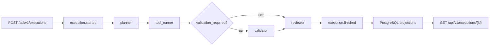

# Обзор архитектуры

## Цели проектирования

- Быстрый путь от проектирования агента до промышленного выполнения
- Централизованное управление агентами, моделями, графами, деплоями и запусками
- Событийная эксплуатация с приоритетом на наблюдаемость и аудит
- Безопасность по умолчанию на уровне платформы и рантайма

Подробный разбор примененных паттернов проектирования и их привязка к коду вынесены в
[docs/architecture/patterns.md](d:/p/FastAPI/FastAPI_Layers/docs/architecture/patterns.md).

## Топология

- `gateway-api` — переходный совместимый вход, агрегирующий все bounded context API в одном процессе для legacy-сценариев и обратной совместимости
- `registry-api` — отдельный микросервис каталога и command/read-side API для агентов, моделей, графов, deployment-ов, инструментов и окружений
- `orchestration-api` — отдельный микросервис запуска execution run и чтения materialized истории выполнений
- `monitoring-api` — отдельный микросервис health, performance, cost, anomaly и drift read models
- `alerting-api` — отдельный микросервис просмотра alert read model
- `audit-api` — отдельный микросервис просмотра audit trail
- `projection-worker` — consumer materialized read-side в PostgreSQL
- `analytics-worker` — consumer secondary metrics, anomaly и drift pipelines
- `alerts-worker` — consumer alert processing и deduplication

### Схема выполнения сценария

У сценария есть два поддерживаемых маршрута:

- базовый: `planner -> tool_runner -> reviewer`
- расширенный: `planner -> tool_runner -> validator -> reviewer`

Ветка с `validator` включается флагом `validation_required` в состоянии графа или `require_validation` во входном `input_payload`. Это позволяет расширять маршрут без изменения стандартного поведения API и уже существующих интеграций.

## Модель CQRS

- Контур записи: `FastAPI` валидирует команду и публикует событие в Kafka
- Контур чтения: потребители проекций материализуют модели чтения в PostgreSQL
- API читает только проекции PostgreSQL и не обращается к Kafka напрямую

## Микросервисная топология

После рефакторинга проект больше не ограничен modular monolith runtime. Сейчас код и локальный deployment-контур поддерживают отдельные сервисные entrypoint-ы:

- `app.services.registry_api`
- `app.services.orchestration_api`
- `app.services.monitoring_api`
- `app.services.alerting_api`
- `app.services.audit_api`

Локально они публикуются на портах:

- `:8080` — compatibility gateway
- `:8081` — registry
- `:8082` — orchestration
- `:8083` — monitoring
- `:8084` — alerting
- `:8085` — audit

Это дает несколько важных эффектов:

- можно масштабировать API bounded context-ы независимо друг от друга;
- можно разворачивать только нужные сервисы в изолированных namespace или кластерах;
- observability и ingress-политики могут настраиваться на уровень конкретного сервиса;
- Helm и Docker Compose теперь повторяют целевую микросервисную схему, а не только логическую модульность кода.

## Компромиссы и решения

- Начальная миграция использует `Base.metadata.create_all`, чтобы гарантировать согласованность стартовой схемы с ORM-моделями. Следующие ревизии лучше вести через явные Alembic-изменения.
- Выполнение сценариев сейчас происходит внутри API-процесса для ускорения стартового сценария. Граница сервиса оркестрации уже выделена и готова к выносу в отдельный воркер.
- Вызов внешнего обработчика использует унифицированный контракт `/invoke` и детерминированный резервный сценарий, чтобы локальный запуск и CI оставались работоспособными даже без внешних интеграций.

## Точки расширения

- Добавление новых топиков и потребителей без изменения API-контрактов
- Замена встроенного orchestration runner на асинхронную диспетчеризацию заданий
- Подключение более сложных детекторов аномалий и дрейфа через регистрацию новых реализаций
- Добавление новых провайдеров уведомлений поверх текущих webhook и email-заглушек
