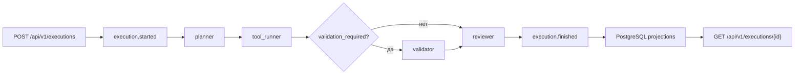

# Обзор архитектуры

## Цели проектирования

- Быстрый путь от проектирования агента до промышленного выполнения
- Централизованное управление агентами, моделями, графами, деплоями и запусками
- Событийная эксплуатация с приоритетом на наблюдаемость и аудит
- Безопасность по умолчанию на уровне платформы и рантайма

Подробный разбор примененных паттернов проектирования и их привязка к коду вынесены в
[docs/architecture/patterns.md](d:/p/FastAPI/FastAPI_Layers/docs/architecture/patterns.md).

## Топология

- `gateway-api` — переходный совместимый вход, агрегирующий все bounded context API в одном процессе для legacy-сценариев и обратной совместимости
- `registry-api` — отдельный микросервис каталога и command/read-side API для агентов, моделей, графов, deployment-ов, инструментов и окружений
- `orchestration-api` — отдельный command-only микросервис запуска execution run
- `orchestration-query-api` — отдельный read-only микросервис чтения materialized истории выполнений
- `monitoring-api` — отдельный микросервис health, performance, cost, anomaly и drift read models
- `alerting-api` — отдельный микросервис просмотра alert read model
- `audit-api` — отдельный микросервис просмотра audit trail
- `projection-worker` — consumer materialized read-side в PostgreSQL
- `analytics-worker` — consumer secondary metrics, anomaly и drift pipelines
- `alerts-worker` — consumer alert processing и deduplication
- `execution-worker` — consumer, который подхватывает `execution.started` и выполняет LangGraph вне HTTP-процесса

### Операционный профиль deployment-ов

Helm chart теперь настраивает не только логическое разделение сервисов, но и их deployment-профили:

- у `apiServices[]` можно независимо переопределять ресурсы, probes, HPA, rollout-стратегию и placement;
- у `workers[]` можно независимо переопределять rollout и placement-параметры, не меняя остальные consumer-роли;
- это позволяет держать `execution-worker` ближе к тяжелым runtime-зависимостям, а `projection-worker` и `alerts-worker` размещать и масштабировать по другим operational правилам.

Практически это значит, что Kubernetes-модель теперь повторяет не только bounded context-границы, но и реальные различия в характере нагрузки:

- API-сервисы оптимизируются под HTTP latency и доступность;
- worker-ы оптимизируются под event consumption, lag и устойчивость к всплескам фоновой нагрузки.

### Схема выполнения сценария

У сценария есть два поддерживаемых маршрута:

- базовый: `planner -> tool_runner -> reviewer`
- расширенный: `planner -> tool_runner -> validator -> reviewer`

Ветка с `validator` включается флагом `validation_required` в состоянии графа или `require_validation` во входном `input_payload`. Это позволяет расширять маршрут без изменения стандартного поведения API и уже существующих интеграций.

## Модель CQRS

- Контур записи: `FastAPI` валидирует команду и публикует событие в Kafka
- Контур чтения: потребители проекций материализуют модели чтения в PostgreSQL
- API читает только проекции PostgreSQL и не обращается к Kafka напрямую

## Микросервисная топология

После рефакторинга проект больше не ограничен modular monolith runtime. Сейчас код и локальный deployment-контур поддерживают отдельные сервисные entrypoint-ы:

- `app.services.registry_api`
- `app.services.orchestration_api`
- `app.services.orchestration_query_api`
- `app.services.monitoring_api`
- `app.services.alerting_api`
- `app.services.audit_api`

Локально они публикуются на портах:

- `:8080` — compatibility gateway
- `:8081` — registry
- `:8082` — orchestration
- `:8086` — orchestration query
- `:8083` — monitoring
- `:8084` — alerting
- `:8085` — audit

### Что остается общим, а что уже разнесено

Эта таблица помогает быстро понять, почему в проекте одновременно встречаются и модульные, и микросервисные формулировки.

| Слой | Что остается общим | Что уже разнесено |
| --- | --- | --- |
| Кодовая база | один репозиторий, общие `app/core`, `app/domain`, `app/db`, единые договоренности по событиям и DTO | bounded context-ы разделены по модулям и уже готовы к дальнейшему physical split |
| API-контур | compatibility gateway сохраняет единый внешний вход для обратной совместимости | `registry-api`, `orchestration-api`, `orchestration-query-api`, `monitoring-api`, `alerting-api`, `audit-api` работают как отдельные сервисы |
| Выполнение сценариев | общая event-модель, общий Kafka backbone, единые correlation и trace conventions | command ingress и фактическое выполнение разделены между `orchestration-api` и `execution-worker` |
| Read-side | единая схема PostgreSQL projections и общий projection-подход | чтение execution history уже вынесено в отдельный `orchestration-query-api`, а monitoring, alerting и audit имеют собственные read API |
| Deployment | один Helm chart и единые базовые values | каждый API-сервис и каждый worker получает собственный deployment-профиль, HPA/KEDA и placement-параметры |
| Observability | единые форматы логов, метрик и tracing conventions | Prometheus, OpenTelemetry и health-маршруты видят и диагностируют каждый сервис как отдельный runtime |

### Service-Specific Runtime

Переход на микросервисную топологию доведен не только до уровня `docker-compose` и отдельных entrypoint-ов, но и до уровня process runtime. Это означает, что каждый сервис поднимает только свой набор зависимостей, а не общий “супер-runtime”.

| Сервис | Что поднимает внутри процесса | Что сознательно не поднимает |
| --- | --- | --- |
| `gateway-api` | все API bounded context: `registry`, `orchestration`, `monitoring`, `alerting`, `audit` | worker-only зависимости |
| `registry-api` | `RegistryCommandService`, `RegistryQueryService`, `AuditService`, `HealthService` | `ExecutionCommandService`, `ModelGateway`, `MonitoringQueryService`, detector-ы, projector |
| `orchestration-api` | `ExecutionCommandService`, `AuditService`, `HealthService` | `ExecutionQueryService`, `ModelGateway`, registry command/query слой, detector-ы, projector |
| `orchestration-query-api` | `ExecutionQueryService`, `HealthService` | `ExecutionCommandService`, `ModelGateway`, `AuditService`, registry command/query слой, detector-ы, projector |
| `monitoring-api` | `MonitoringQueryService`, `HealthService` | command-side registry/orchestration, `ModelGateway`, projector, detector-ы |
| `alerting-api` | `AlertQueryService`, `HealthService` | alert processing worker logic, command-side сервисы, projector |
| `audit-api` | `AuditQueryService`, `HealthService` | command-side audit emitters, orchestration и registry зависимости |
| `worker` | publisher, `ProjectionService`, anomaly/drift detector-ы, `AlertingService`, `ExecutionCommandService`, `ModelGateway` | HTTP-роутеры и API query/command сервисы |

Такой разрез уменьшает связность процессов, снижает лишнюю инициализацию зависимостей и делает следующий шаг к полному physical split проще: код уже знает, какие сервисы действительно принадлежат конкретному deployable unit.

После выноса `execution-worker` orchestration API больше не обязан исполнять LangGraph внутри HTTP-процесса. Его задача — принять команду, зафиксировать `execution.started` и передать фактическое выполнение в Kafka-backed worker-контур. Это уменьшает latency API, делает запуск сценариев более устойчивым к всплескам нагрузки и позволяет масштабировать execution-путь отдельно от read/query API.

Отдельный `orchestration-api` теперь intentionally command-only: в его OpenAPI остаются `POST /api/v1/executions` и health/metrics endpoints. Read-side маршруты `GET /api/v1/executions*` вынесены в `orchestration-query-api`, а compatibility gateway по-прежнему агрегирует оба контура для обратной совместимости.

Это дает несколько важных эффектов:

- можно масштабировать API bounded context-ы независимо друг от друга;
- можно разворачивать только нужные сервисы в изолированных namespace или кластерах;
- observability и ingress-политики могут настраиваться на уровень конкретного сервиса;
- Helm и Docker Compose теперь повторяют целевую микросервисную схему, а не только логическую модульность кода.

### Публикация через ingress

По умолчанию chart оставляет `gateway-api` единственной внешней точкой входа. Это снижает риск случайно открыть наружу внутренние read/admin API и сохраняет простой публичный контракт.

При этом у каждого API-сервиса теперь есть управляемая опция отдельной публикации:

- `apiServices[].ingress.enabled=true` включает ingress-маршрут для сервиса;
- `apiServices[].ingress.separateIngress=false` оставляет сервис внутри общего ingress-объекта;
- `apiServices[].ingress.separateIngress=true` создает отдельный Ingress только для этого сервиса.
- у отдельного ingress можно переопределить `hosts`, `annotations`, `className` и `tls` на уровне конкретного сервиса.
- на уровне сервиса также можно отдельно переопределить `replicaCount`, `resources`, `probes`, `autoscaling`, `terminationGracePeriodSeconds`, `revisionHistoryLimit`, `strategy`, `podAnnotations`, `nodeSelector`, `tolerations`, `affinity` и `topologySpreadConstraints`;
- для наследования глобального HPA сервис оставляет `autoscaling: {}`, а для явного отключения задает `autoscaling.enabled: false`.

Этот режим особенно полезен для `orchestration-query-api`, когда read-side нужно открыть внутренним пользователям или платформенному tooling отдельно от внешнего gateway.

## Компромиссы и решения

- Начальная миграция использует `Base.metadata.create_all`, чтобы гарантировать согласованность стартовой схемы с ORM-моделями. Следующие ревизии лучше вести через явные Alembic-изменения.
- Командный ingress и фактическое выполнение теперь разделены: `orchestration-api` принимает команду и публикует `execution.started`, а `execution-worker` подхватывает событие из Kafka и исполняет LangGraph вне HTTP-процесса.
- Вызов внешнего обработчика использует унифицированный контракт `/invoke` и детерминированный резервный сценарий, чтобы локальный запуск и CI оставались работоспособными даже без внешних интеграций.

## Точки расширения

- Добавление новых топиков и потребителей без изменения API-контрактов
- Замена встроенного orchestration runner на асинхронную диспетчеризацию заданий
- Подключение более сложных детекторов аномалий и дрейфа через регистрацию новых реализаций
- Добавление новых провайдеров уведомлений поверх текущих webhook и email-заглушек
