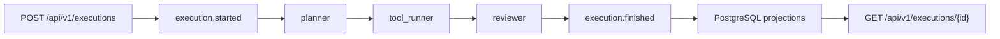

# Обзор архитектуры

## Цели проектирования

- Быстрый путь от проектирования агента до промышленного выполнения
- Централизованное управление агентами, моделями, графами, деплоями и запусками
- Событийная эксплуатация с приоритетом на наблюдаемость и аудит
- Безопасность по умолчанию на уровне платформы и рантайма

## Топология

- `registry` обрабатывает CRUD-команды и публикует события в Kafka
- `orchestration` запускает распределенные сценарии и публикует события выполнения, шагов, стоимости, метрик и вызовов внешних обработчиков
- `monitoring` потребляет потоки метрик и телеметрии для поиска аномалий и дрейфа
- `alerting` выполняет дедупликацию сигналов и маршрутизацию уведомлений
- `projections` материализует модели чтения в PostgreSQL для всех API

### Схема выполнения сценария

## Модель CQRS

- Контур записи: `FastAPI` валидирует команду и публикует событие в Kafka
- Контур чтения: потребители проекций материализуют модели чтения в PostgreSQL
- API читает только проекции PostgreSQL и не обращается к Kafka напрямую

## Компромиссы и решения

- Начальная миграция использует `Base.metadata.create_all`, чтобы гарантировать согласованность стартовой схемы с ORM-моделями. Следующие ревизии лучше вести через явные Alembic-изменения.
- Выполнение сценариев сейчас происходит внутри API-процесса для ускорения стартового сценария. Граница сервиса оркестрации уже выделена и готова к выносу в отдельный воркер.
- Вызов внешнего обработчика использует унифицированный контракт `/invoke` и детерминированный резервный сценарий, чтобы локальный запуск и CI оставались работоспособными даже без внешних интеграций.

## Точки расширения

- Добавление новых топиков и потребителей без изменения API-контрактов
- Замена встроенного orchestration runner на асинхронную диспетчеризацию заданий
- Подключение более сложных детекторов аномалий и дрейфа через регистрацию новых реализаций
- Добавление новых провайдеров уведомлений поверх текущих webhook и email-заглушек
