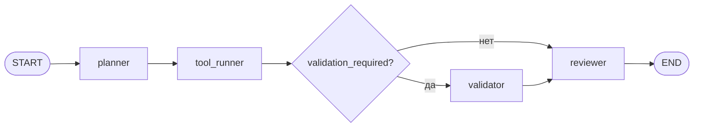

# Использование LangGraph

## Назначение

Этот документ описывает, как `LangGraph` используется внутри проекта, где расположен orchestration-контур, как добавлять новые узлы и переходы, и что обязательно проверить после изменений в графе.

## Где используется LangGraph

Основная интеграция находится в [app/modules/orchestration/graph.py](d:/p/FastAPI/FastAPI_Layers/app/modules/orchestration/graph.py).

Ключевые элементы:

- `ExecutionState` описывает состояние, которое проходит через граф;
- `ExecutionWorkflow` собирает граф и предоставляет метод `invoke(...)`;
- `StateGraph` используется для регистрации узлов и ребер;
- `START` и `END` задают начало и конец сценария;
- `ModelGateway` обеспечивает вызов внешнего обработчика для шагов, которым нужен вычислительный backend;
- `step_emitter` публикует события шага и метрики во внешнюю инфраструктуру.

## Текущий граф выполнения

В проекте реализован базовый сценарий из трех обязательных узлов и одной условной ветки:

1. `planner`
2. `tool_runner`
3. `validator` (только если в состоянии включена валидация)
4. `reviewer`

Последовательность связей:

```text
START -> planner -> tool_runner -> reviewer -> END
START -> planner -> tool_runner -> validator -> reviewer -> END
```

Каждый узел получает текущее состояние, возвращает частичное обновление состояния и при необходимости публикует телеметрию шага.

### Диаграмма графа



## Состояние графа

Состояние описано через `TypedDict` `ExecutionState`.

Типовые поля:

- `execution_run_id`
- `deployment_id`
- `graph_definition_id`
- `input_payload`
- `objective`
- `model_context`
- `plan`
- `tool_output`
- `validation_required`
- `validation_summary`
- `review`
- `final_output`

Практическое правило:

- добавляйте в `ExecutionState` только те поля, которые действительно должны жить между шагами;
- не складывайте в состояние лишние технические детали, если они уже есть в telemetry или event payload;
- если новое поле влияет на финальный контракт результата, синхронно обновляйте DTO, сервис оркестрации и тесты.

## Как устроен ExecutionWorkflow

`ExecutionWorkflow` делает три вещи:

1. собирает граф в `_build()`;
2. запускает граф через `ainvoke(...)`;
3. инкапсулирует реализацию отдельных шагов.

Сборка графа выглядит концептуально так:

```python
graph = StateGraph(ExecutionState)
graph.add_node("planner", self._planner)
graph.add_node("tool_runner", self._tool_runner)
graph.add_node("validator", self._validator)
graph.add_node("reviewer", self._reviewer)
graph.add_edge(START, "planner")
graph.add_edge("planner", "tool_runner")
graph.add_conditional_edges(
    "tool_runner",
    self._route_after_tool_runner,
    {"validator": "validator", "reviewer": "reviewer"},
)
graph.add_edge("validator", "reviewer")
graph.add_edge("reviewer", END)
compiled = graph.compile()
```

Важный момент:

- граф компилируется один раз при создании `ExecutionWorkflow`;
- дальше сервис оркестрации использует уже готовый compiled graph;
- это упрощает повторное выполнение и держит orchestration-код локализованным в одном месте.

## Роль каждого узла

### `planner`

Задача узла:

- взять исходную цель;
- подготовить план выполнения;
- вернуть `plan` и telemetry.

Что публикуется наружу:

- step event через `step_emitter`;
- длительность шага;
- usage и cost telemetry при наличии вызова через gateway.

### `tool_runner`

Задача узла:

- использовать `plan`;
- выполнить локальную прикладную обработку;
- вернуть `tool_output`.

Особенность:

- этот шаг в текущей реализации работает локально и заполняет встроенную telemetry без внешнего сетевого вызова.

### `reviewer`

Задача узла:

- получить `plan` и `tool_output`;
- учесть `validation_summary`, если был пройден `validator`;
- сформировать итоговую валидацию;
- вернуть `review` и `final_output`.

### `validator`

Задача узла:

- принять результат `tool_runner`;
- выполнить дополнительную локальную проверку;
- вернуть `validation_summary`, который затем попадет в `reviewer`.

Особенность:

- шаг вызывается только при `validation_required=True`;
- по умолчанию текущий сценарий остается линейным и полностью совместимым с прежним маршрутом.

## Взаимодействие с сервисом оркестрации

`LangGraph` не вызывается напрямую из API-роута.

Поток исполнения такой:

1. endpoint `/api/v1/executions` принимает команду;
2. `ExecutionCommandService` создает `execution.started`;
3. сервис создает `ExecutionWorkflow`;
4. workflow запускается асинхронно;
5. шаги публикуют `step.completed`;
6. в конце публикуется `execution.finished` или `execution.failed`.

Соответствующий сервис находится в [app/modules/orchestration/service.py](d:/p/FastAPI/FastAPI_Layers/app/modules/orchestration/service.py).

## Как добавить новый узел

Допустим, нужно добавить шаг `validator` между `tool_runner` и `reviewer`.

Последовательность действий:

1. Добавьте новое поле в `ExecutionState`, если шаг передает новое состояние дальше.
2. Реализуйте асинхронный метод, например `_validator(self, state) -> dict[str, Any]`.
3. Зарегистрируйте узел в `_build()`:

```python
graph.add_node("validator", self._validator)
```

4. Измените переходы:

```python
graph.add_edge("tool_runner", "validator")
graph.add_edge("validator", "reviewer")
```

5. При необходимости публикуйте step telemetry через `step_emitter`.
6. Обновите тесты и документацию.

### Практический пример добавления узла

Если нужен дополнительный шаг проверки перед финальным ответом, удобно вставить `validator` между `tool_runner` и `reviewer`.

Идея изменений:

```python
graph.add_node("validator", self._validator)
graph.add_edge("tool_runner", "validator")
graph.add_edge("validator", "reviewer")
```

Что еще нужно сделать помимо `add_node(...)` и `add_edge(...)`:

- при необходимости добавить новое поле в `ExecutionState`;
- передать через `step_emitter` telemetry нового шага;
- обновить проверки в тестах на ожидаемое число шагов;
- обновить описание графа в документации.

## Как изменить маршрут графа

Если нужен условный переход, придерживайтесь такого подхода:

- храните decision data в `ExecutionState`;
- выделяйте логику выбора ветки в отдельную функцию;
- делайте условие прозрачным и тестируемым;
- не прячьте принятие решения в случайные побочные эффекты внутри шага.

Текущий проект использует именно этот подход после `tool_runner`:

```python
def _route_after_tool_runner(self, state: ExecutionState) -> str:
    if state.get("validation_required"):
        return "validator"
    return "reviewer"
```

Флаг может приходить:

- напрямую в `ExecutionState["validation_required"]`;
- через `input_payload["require_validation"]`, если ветка должна включаться входным запросом.

При добавлении ветвлений важно проверить:

- все ли ветки доходят до `END`;
- не теряются ли обязательные поля состояния;
- публикуются ли события для каждого шага независимо от ветки;
- не ломается ли projection layer при новой последовательности событий.

## Telemetry и step_emitter

`LangGraph` в этом проекте связан с внешним event-driven контуром через `step_emitter`.

Он отвечает за:

- публикацию `step.completed`;
- запись метрик длительности шага;
- публикацию системных метрик;
- публикацию cost events;
- публикацию событий обработчика, связанных с вычислительным вызовом.

Если вы меняете поля telemetry в узле, нужно синхронно проверить:

- [app/modules/orchestration/service.py](d:/p/FastAPI/FastAPI_Layers/app/modules/orchestration/service.py)
- [app/workers.py](d:/p/FastAPI/FastAPI_Layers/app/workers.py)
- [app/projections/projector.py](d:/p/FastAPI/FastAPI_Layers/app/projections/projector.py)
- интеграционные тесты Kafka и API

## Работа с ModelGateway внутри LangGraph

`planner` и `reviewer` используют [app/modules/orchestration/gateway.py](d:/p/FastAPI/FastAPI_Layers/app/modules/orchestration/gateway.py).

Gateway:

- отправляет запрос во внешний endpoint `/invoke`;
- умеет возвращать fallback-результат;
- рассчитывает latency, usage и cost telemetry;
- возвращает `ModelInvocationResult`.

Практический смысл:

- orchestration-логика остается в графе;
- сетевое взаимодействие остается в gateway;
- telemetry остается согласованной между шагами.

## Что проверять после изменений в LangGraph

Минимальный чеклист:

1. `uv run ruff check .`
2. `uv run mypy app tests`
3. `uv run pytest tests/unit/test_execution_workflow.py -q`
4. `uv run pytest tests/integration/test_api_flow.py -q`
5. `uv run pytest tests/integration/test_kafka_flow.py -q`

Если менялась документация:

```bash
uv run mkdocs build
```

Если менялась структура payload или telemetry:

- проверьте публикацию `execution.started`;
- проверьте все `step.completed`;
- проверьте `execution.finished` или `execution.failed`;
- проверьте read side на `/api/v1/executions`;
- проверьте связанный Kafka flow.

## Тестирование LangGraph-слоя

Для `LangGraph`-части в проекте полезно держать два уровня тестов:

### Быстрые unit-тесты

Они должны проверять:

- что граф вообще выполняется;
- что узлы отдают ожидаемые ключи состояния;
- что `step_emitter` вызывается для каждого шага;
- что итоговый `final_output` собирается корректно.

Типовой кандидат для такого теста:

- [tests/unit/test_execution_workflow.py](d:/p/FastAPI/FastAPI_Layers/tests/unit/test_execution_workflow.py)

### Интеграционные тесты

Они должны проверять:

- создание `execution.started`;
- публикацию `step.completed`;
- завершение `execution.finished`;
- корректную материализацию `execution_runs` и `execution_steps`.
- последовательность Kafka-событий для шагов и метрик.

Типовые файлы:

- [tests/integration/test_api_flow.py](d:/p/FastAPI/FastAPI_Layers/tests/integration/test_api_flow.py)
- [tests/integration/test_kafka_flow.py](d:/p/FastAPI/FastAPI_Layers/tests/integration/test_kafka_flow.py)

В частности, Kafka-интеграционный тест должен подтверждать:

- публикацию `execution.started`;
- публикацию трех или четырех `step.completed` в зависимости от выбранной ветки;
- наличие системных метрик шага;
- публикацию `execution.finished`.

Дополнительно unit-тест должен отдельно покрывать условную ветку:

- базовый проход без `validator`;
- проход с `validator`, когда `validation_required=True`.

## Частые ошибки при работе с LangGraph

### 1. Шаг возвращает не тот ключ состояния

Пример проблемы:

- шаг вычислил `review`, но вернул поле с другим именем;
- следующий узел не видит нужные данные.

Решение:

- держите ключи строго согласованными с `ExecutionState`.

### 2. Новый узел не включен в цепочку переходов

Узел зарегистрирован, но в графе нет `add_edge(...)`.

Решение:

- после добавления каждого узла проверяйте полный путь от `START` до `END`.

### 3. Изменили telemetry, но не обновили downstream-обработчики

Решение:

- синхронно проверяйте orchestration service, workers и projection layer.

### 4. В графе появилась сложная бизнес-логика

Решение:

- тяжелую прикладную логику лучше выносить в отдельные сервисы или gateway-объекты;
- сам граф должен оставаться местом координации шагов, а не местом накопления всей бизнес-логики.

## Рекомендации по развитию

- держите узлы маленькими и специализированными;
- минимизируйте количество полей в общем состоянии;
- отделяйте orchestration от сетевых и инфраструктурных вызовов;
- не меняйте event payload без одновременного обновления projections и тестов;
- документируйте каждый новый узел и каждую новую ветку графа.
